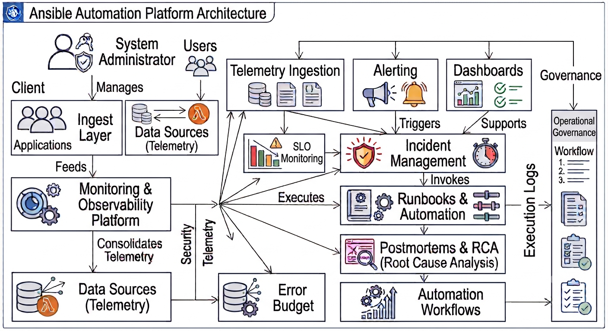

# 🚀 Ansible Automation Platform


---

# Overview

This repository demonstrates production-inspired Ansible automation practices for configuration management, infrastructure automation, application deployment, patch management, and operational consistency.

It covers inventories, playbooks, roles, variables, templates, handlers, Ansible Vault, dynamic inventory, Ansible Galaxy, and deployment strategies following infrastructure automation best practices.

---

# Architecture



---

# Automation Workflow

Administrator

↓

Ansible Control Node

↓

Inventories

↓

Playbooks

↓

Variables & Templates

↓

Roles & Handlers

↓

Managed Infrastructure

↓

Configuration Management

↓

Validation & Idempotency

↓

Continuous Automation

---

# Features

- Static & Dynamic Inventories
- Playbooks
- Roles
- Variables
- Templates (Jinja2)
- Handlers
- Ansible Vault
- Ansible Galaxy
- Configuration Management
- Infrastructure Automation
- Application Deployment
- Patch Management
- Idempotent Automation

---

# Repository Structure

```text
ansible-automation-platform/

├── architecture/
├── docs/
├── inventories/
├── playbooks/
├── roles/
├── group_vars/
├── host_vars/
├── templates/
├── files/
├── examples/
└── assets/
```

---

# Documentation

| Document | Description |
|----------|-------------|
| ansible-overview.md | Introduction to Ansible |
| inventories.md | Static and dynamic inventories |
| playbooks.md | Playbook structure |
| roles.md | Reusable roles |
| variables.md | Variables and precedence |
| handlers.md | Event-driven handlers |
| templates.md | Jinja2 templates |
| ansible-vault.md | Secret management |
| dynamic-inventory.md | Cloud inventory |
| ansible-galaxy.md | Collections and roles |
| deployment.md | Deployment strategies |
| best-practices.md | Recommended practices |

---

# Included Examples

- Production inventory
- Multi-role deployment
- NGINX installation
- Docker deployment
- Monitoring configuration
- Vault example
- Dynamic inventory

---

# Future Improvements

- AWX / Automation Controller
- Execution Environments
- Molecule Testing
- CI/CD Integration
- Event-Driven Ansible
- Multi-cloud Automation

---

# License

This project is licensed under the MIT License.